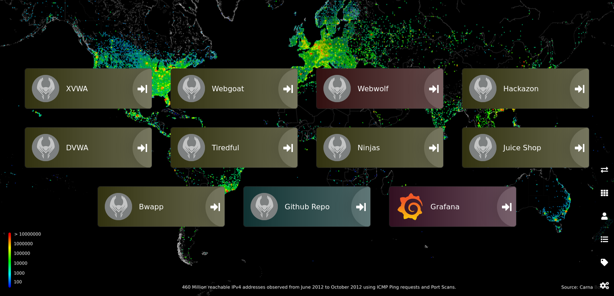

# Pentest Lab

This local pentest lab leverages docker compose to spin up multiple victim
services and an attacker service running Kali Linux.  If you run this lab for
the first time it will take some time to download all the different docker
images.

## Screencast

[](https://asciinema.org/a/345707)

## Usage

The lab should work out of the box if all needed dependencies are installed.
At startup the lab will run a dependency check.

### Start the lab

```bash
git clone https://github.com/oliverwiegers/pentest_lab
cd pentest_lab
./lab.sh -u
```

By default the lab will start all victim services and one red team service.
Other services can be started and added. More information on this down on this
below.

For further usage information consider reading the help message shown by
`./lab.sh -h | --help`.

### Heimdall

For ease of use a [Heimdall](https://github.com/linuxserver/Heimdall) interface
was added that ist exported to http://localhost:7000.
All services that are exposed to you local machine and can be accessed via
browser are listed there.



Used wallpaper can be found [here](https://wallpapercave.com/w/wp6241750).

## Requirements

- bash
- find
- sed
- yq (The Python version. Not yq-go.)
- docker
- docker-compose

The lab has a build in dependency check which runs at startup. This also can be
run manually `./lab.sh -C`.

## Services

This lab knows the following four types of services.

- red_team
- blue_team
- victim
- monitoring

The default red team service - the Kali service - is a pretty basic Kali
instance. Nonetheless `kali-tools-web` metapackage is installed. For a web
application testing lab the basic web testing tools seem to be useful.
This can be changed by editing the Dockerfile from which the image is
build. This is located at `./dockerfiles/kali`.
The kali service installs my
[dotfiles](https://github.com/oliverwiegers/dotfiles) by default. If you don't
like these you can change this.

Currently the blue team and monitoring services are not properly configured.
They only serve as examples to showcase the ability to add those.

### Victim services

- [juice-shop](https://github.com/bkimminich/juice-shop)
- [hackazon](https://github.com/rapid7/hackazon)
- [tiredful-api](https://github.com/payatu/Tiredful-API)
- [WebGoat](https://owasp.org/www-project-webgoat/)
- [bwapp](http://www.itsecgames.com/)
- [DVWA](http://www.dvwa.co.uk/)
- [XVWA](https://github.com/s4n7h0/xvwa)
- [ninjas](https://umbrella.cisco.com/blog/security-ninjas-an-open-source-application-security-training-program)

### Adding services

To add additional services a little knowledge of `docker-compose.yml` files is
needed. The `docker-compose.yml` in the root of this repository is auto
generated when the lab starts. This process uses the yaml files located unter
`./etc/services`.

```bash
➜  pentest_lab tree ./etc/services
./etc/services
├── blue_team
│   └── endlessh.yml
├── default.yml
├── monitoring
│   ├── grafana.yml
│   └── prometheus.yml
├── red_team
└── victim
    ├── beginner
    │   ├── bwapp.yml
    │   ├── dvwa.yml
    │   ├── hackazon.yml
    │   ├── tiredful.yml
    │   └── webgoat.yml
    ├── expert
    │   └── juice-shop.yml
    └── intermediate
        └── ninjas.yml
```

Which services will be started is controlled by invoking `./lab.sh` with the
corresponding options. To permanently disable a service remove the `.yml` file
extension.

An example of a victim service would be:

```yaml
bwapp:
  labels:
    class: 'victim'
    cluster: 'pentest_lab'
    level: 'beginner'
  image: raesene/bwapp
  ports:
    - '8080:80'
  networks:
    pentest_lab:
      ipv4_address: 10.5.0.100
  hostname: bwapp
  volumes:
    - bwapp-data:/var/lib/mysql
```

Note: If a service requires some kind of installation at first usage use
`docker inspect <image_name>` to find out where the docker image stores the data
and add a volume pointing to this directory. In the example above this is:

```yaml
  volumes:
    - bwapp-data:/var/lib/mysql
```

This ensures that you don't have to setup the service again every time you
restart the lab. But if you want to reset the lab and completely start over
again you can use `./lab.sh -p | --prune`. This will delete all resources owned by
the lab.

#### IP ranges

The reason we used static IP addresses is that the Kali box needs to have an IP
address that doesn't change to simplify SSH login. More in information in the
Tips/Tricks section down below.

- Red team services start at 10.5.0.5
    - The Kali service has 10.5.0.5.
- Blue team services start at 10.5.0.50
- Victim services start at 10.5.0.100
- Monitoring services start at 10.5.0.200

#### Service Info

If you add services and there is additional information that is useful for
anyone running this lab you can add this information to `./etc/services_info`.
Content of this file will be printed as is line by line by running
`./lab.sh -i`.

## Tips/Tricks

For an easy connect to the Kali service one could add the following to
`$HOME/.ssh/cofig`:

```ssh-config
Host kali
    User root
    Hostname 10.5.0.5
    IgnoreUnknown UseKeychain
    UseKeychain yes
    UserKnownHostsFile /dev/null
    StrictHostKeyChecking accept-new
```

So instead of `ssh root@10.5.0.5 -o "UserKnownHostsFile /dev/null"` one could
run `ssh kali`.

## TODO

- [x] Refactor the scripts running this lab. Some of these lines are just quick
  and dirty fixed.
- [ ] Add central logging instance, to monitor how applications behave under
  attack.
- [x] Add -A | --all-services flag to avaid `./lab.sh -u -m all -r all -b all`
- [ ] Linting/Testing
    - [x] Linting
        - [x] Run shellcheck on sh/bash scripts.
        - [x] Run yamllint on service definitions.
        - [x] Run mdl on markdown files.
    - [ ] Testing
        - [ ] Write bash tests using [bats-core](https://github.com/bats-core/bats-core)
- [x] Move definition of information displayed by `./lab.sh -i` from code to
  file.
- [x] Add CONTRIBUTING.
